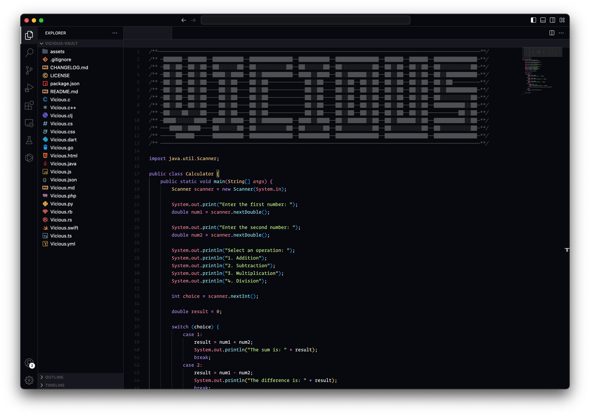

 

<h1 align="center">
Vicious Theme
</h1>

<h2 align="center">
 A Sleek and Immersive Dark Theme for <a href="http://code.visualstudio.com">Visual Studio Code</a>
</h2>
Elevate your coding experience with Vicious, a sleek and immersive dark theme for <a href="http://code.visualstudio.com">Visual Studio Code</a>. Designed for minimalism, readability, and aesthetics, Vicious enhances your focus and reduces eye strain. Customize it to match your style and enjoy an elegant and efficient coding environment.
   

# Installation

## Installing the Vicious Theme: Step-by-Step Guide

To install the Vicious theme for your desired application or tool, follow these general steps:

- Install Visual Studio Code
- Launch Visual Studio Code
- Choose Extensions from menu
- Search for **Vicious**
  Click Install to install it
  Click Reload to reload the Code
  From the menu bar click: Code > Preferences > Color Theme > **Vicious**

# Supported Apps and Tools

Experience a consistent and visually appealing coding environment with Vicious, a dark theme that extends beyond your favorite coding tool. Whether you're working in different text editors or using various development applications, Vicious ensures a seamless and immersive dark theme experience. Elevate your coding journey across multiple platforms by downloading Vicious today.

The apps and tools that support the Vicious theme include:

- [Visual Studio Code](#)

  - Visual Studio Code, also commonly referred to as VS Code, is a source-code editor developed by Microsoft for Windows, Linux and macOS. Features include support for debugging, syntax highlighting, intelligent code completion, snippets, code refactoring, and embedded Git.

- [Obsidian](#)
  - Obsidian is a personal knowledge base and note-taking software application that operates on Markdown files. It allows users to make internal links for notes and then to visualize the connections as a graph. It is designed to help users organize and structure their thoughts and knowledge in a flexible, non-linear way.

# Contribute to Vicious theme

Contribute to the Vicious theme and make a difference! Your input is valuable in enhancing the Vicious theme for Visual Studio Code. Whether you have ideas, suggestions, or want to help with bug fixes, your contributions are welcome.

Make your code shine in the Vicious theme!

<!--
npm i -g vsce
vsce package
-->
